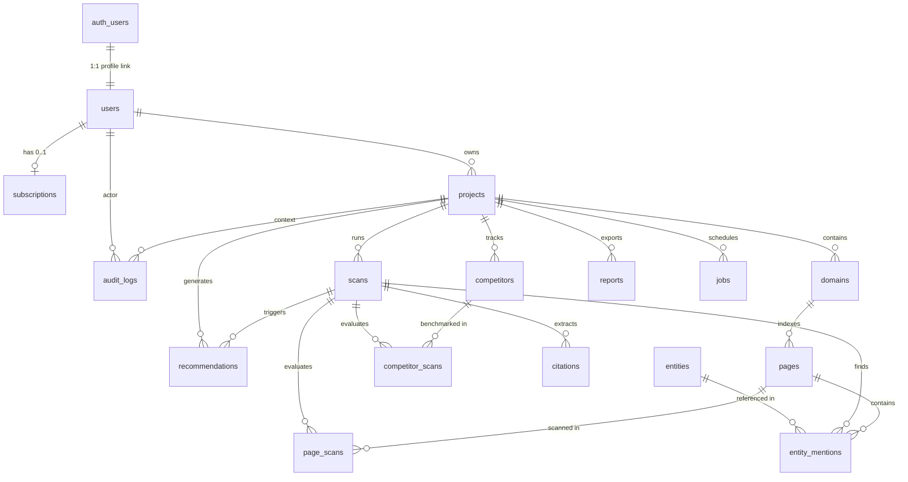

# Database Schema Design Specification

**AI Visibility OS — Supabase / PostgreSQL Architecture**
*Status: Design Document for Human Review (Phase 1 MVP)*

---

## 1. Executive Summary & Design Principles

This document specifies the PostgreSQL database schema for **AI Visibility OS**, deployed on **Supabase**. The schema is engineered to provide a scalable, highly normalized foundation for AI search engine visibility monitoring, domain scoring, competitor benchmarking, citation analysis, and automated recommendation tracking.

### Core Architectural Principles:
1. **Supabase Auth Integration**: `public.users` functions strictly as a profile table bound 1:1 to `auth.users(id)`.
2. **Traceable Ownership Path**: Every table maintains a deterministic foreign key chain leading back to `auth.users`, eliminating redundant `user_id` columns across deep child tables.
3. **Strict Normalization (3NF)**: Data duplication is avoided across tables. JSONB is used strictly for variable payload objects (e.g., job parameters or audit metadata).
4. **Soft Delete Strategy**: High-value historical entities (`projects`, `domains`, `scans`, `reports`) utilize `deleted_at IS NULL` filters to prevent catastrophic accidental data loss and enable trend auditing.
5. **Security via RLS**: Every table defines explicit RLS filter target columns to enable tenant isolation via Supabase RLS policies.
6. **Scalability Preparedness**: Table partitioning strategies are pre-designed for high-volume append tables (`page_scans`, `audit_logs`, `citations`).

---

## 2. Deferred Scope & Architectural Decisions

### Deferrals to Phase 2:
- **`knowledge_graph`**: *Knowledge Graph and semantic entity relationship nodes are deferred to Phase 2.* For MVP, entity detection is handled via normalized `entities` and `entity_mentions` tables.
- **`chat_sessions` & `chat_messages`**: *Conversational AI chat sessions and message logs are deferred to Phase 2.* MVP focuses on automated AI model scanning, visibility benchmarking, citation parsing, recommendations, and report generation. Chat interfaces build upon these baseline metrics in Phase 2.

---

## 3. Entity Relationship Diagram (ERD)



---

## 4. Core Table Specifications

### 4.1 `users`
- **Description**: Public profile table extension for Supabase Auth users.
- **Ownership Path**: Direct 1:1 binding to `auth.users.id`.
- **Soft Delete**: None. User profile lifecycle is managed via Supabase Auth.

| Column | Type | Constraints | Description |
| :--- | :--- | :--- | :--- |
| `id` | `UUID` | `PRIMARY KEY`, `REFERENCES auth.users(id) ON DELETE CASCADE` | Unique user ID tied directly to Supabase Auth. |
| `email` | `VARCHAR(255)` | `NOT NULL`, `UNIQUE` | User email address synced from auth. |
| `full_name` | `VARCHAR(255)` | `NULL` | Full display name of the user. |
| `avatar_url` | `TEXT` | `NULL` | Profile picture URL. |
| `role` | `VARCHAR(50)` | `NOT NULL DEFAULT 'user'` | System role (`user`, `admin`, `owner`). |
| `created_at` | `TIMESTAMPTZ` | `NOT NULL DEFAULT CURRENT_TIMESTAMP` | Profile creation timestamp. |
| `updated_at` | `TIMESTAMPTZ` | `NOT NULL DEFAULT CURRENT_TIMESTAMP` | Profile update timestamp. |

- **Indexes**:
  - `idx_users_email` ON `users(email)` — Fast lookups by email address.
- **RLS Filter Target**: `id` (`auth.uid() = id`).

---

### 4.2 `subscriptions`
- **Description**: Subscription plan and billing status per user.
- **Ownership Path**: `user_id` -> `users.id` -> `auth.users.id`.
- **Soft Delete**: None. Managed statefully via `status = 'canceled'`.

| Column | Type | Constraints | Description |
| :--- | :--- | :--- | :--- |
| `id` | `UUID` | `PRIMARY KEY DEFAULT gen_random_uuid()` | Unique subscription identifier. |
| `user_id` | `UUID` | `NOT NULL`, `UNIQUE`, `REFERENCES users(id) ON DELETE RESTRICT` | Target subscriber profile ID. |
| `stripe_customer_id` | `VARCHAR(255)` | `NULL` | External Stripe Customer ID. |
| `stripe_subscription_id` | `VARCHAR(255)` | `NULL` | External Stripe Subscription ID. |
| `plan_tier` | `VARCHAR(50)` | `NOT NULL DEFAULT 'free'` | Plan tier (`free`, `pro`, `enterprise`). |
| `status` | `VARCHAR(50)` | `NOT NULL DEFAULT 'active'` | Status (`active`, `past_due`, `canceled`, `trailing`). |
| `current_period_start` | `TIMESTAMPTZ` | `NULL` | Start of current billing cycle. |
| `current_period_end` | `TIMESTAMPTZ` | `NULL` | End of current billing cycle. |
| `created_at` | `TIMESTAMPTZ` | `NOT NULL DEFAULT CURRENT_TIMESTAMP` | Record creation timestamp. |
| `updated_at` | `TIMESTAMPTZ` | `NOT NULL DEFAULT CURRENT_TIMESTAMP` | Record update timestamp. |

- **Indexes**:
  - `idx_subscriptions_user_id` ON `subscriptions(user_id)` — Quick user billing resolution.
  - `idx_subscriptions_stripe_customer_id` ON `subscriptions(stripe_customer_id)` — Stripe webhook lookup.
- **RLS Filter Target**: `user_id` (`auth.uid() = user_id`).

---

### 4.3 `projects`
- **Description**: Top-level workspace container for user monitoring resources.
- **Ownership Path**: `user_id` -> `users.id` -> `auth.users.id`.
- **Soft Delete**: Yes (`deleted_at`). Preserves historical audit records and project recovery.

| Column | Type | Constraints | Description |
| :--- | :--- | :--- | :--- |
| `id` | `UUID` | `PRIMARY KEY DEFAULT gen_random_uuid()` | Unique project identifier. |
| `user_id` | `UUID` | `NOT NULL`, `REFERENCES users(id) ON DELETE CASCADE` | Project owner user ID. |
| `name` | `VARCHAR(255)` | `NOT NULL` | Project name. |
| `description` | `TEXT` | `NULL` | Project description. |
| `target_keywords` | `TEXT[]` | `NULL` | Key industry terms targeted for visibility monitoring. |
| `created_at` | `TIMESTAMPTZ` | `NOT NULL DEFAULT CURRENT_TIMESTAMP` | Record creation timestamp. |
| `updated_at` | `TIMESTAMPTZ` | `NOT NULL DEFAULT CURRENT_TIMESTAMP` | Record update timestamp. |
| `deleted_at` | `TIMESTAMPTZ` | `NULL` | Soft delete timestamp. |

- **Indexes**:
  - `idx_projects_user_id` ON `projects(user_id) WHERE deleted_at IS NULL` — Active projects per user.
  - `idx_projects_deleted_at` ON `projects(deleted_at)` — Soft delete cleanup routines.
- **RLS Filter Target**: `user_id` (`auth.uid() = user_id`).

---

### 4.4 `domains`
- **Description**: Tracked web domains associated with a project.
- **Ownership Path**: `project_id` -> `projects.id` -> `user_id` -> `auth.users.id`.
- **Soft Delete**: Yes (`deleted_at`). Prevents accidental loss of domain history.

| Column | Type | Constraints | Description |
| :--- | :--- | :--- | :--- |
| `id` | `UUID` | `PRIMARY KEY DEFAULT gen_random_uuid()` | Unique domain identifier. |
| `project_id` | `UUID` | `NOT NULL`, `REFERENCES projects(id) ON DELETE CASCADE` | Parent project ID. |
| `domain_name` | `VARCHAR(255)` | `NOT NULL` | Domain name (e.g. `example.com`). |
| `is_primary` | `BOOLEAN` | `NOT NULL DEFAULT false` | Flag indicating primary domain for scoring. |
| `status` | `VARCHAR(50)` | `NOT NULL DEFAULT 'active'` | Domain status (`active`, `paused`, `archived`). |
| `created_at` | `TIMESTAMPTZ` | `NOT NULL DEFAULT CURRENT_TIMESTAMP` | Record creation timestamp. |
| `updated_at` | `TIMESTAMPTZ` | `NOT NULL DEFAULT CURRENT_TIMESTAMP` | Record update timestamp. |
| `deleted_at` | `TIMESTAMPTZ` | `NULL` | Soft delete timestamp. |

- **Indexes**:
  - `idx_domains_project_id` ON `domains(project_id) WHERE deleted_at IS NULL` — Project domain lookup.
  - `idx_domains_domain_name` ON `domains(domain_name)` — Exact domain string lookup.
- **RLS Filter Target**: `project_id` (`EXISTS (SELECT 1 FROM projects WHERE projects.id = domains.project_id AND projects.user_id = auth.uid())`).

---

### 4.5 `pages`
- **Description**: Discovered or configured URLs under a tracked domain.
- **Ownership Path**: `domain_id` -> `domains.id` -> `projects.id` -> `user_id` -> `auth.users.id`.
- **Soft Delete**: None. Pages are child URL references that cascade on domain removal.

| Column | Type | Constraints | Description |
| :--- | :--- | :--- | :--- |
| `id` | `UUID` | `PRIMARY KEY DEFAULT gen_random_uuid()` | Unique page identifier. |
| `domain_id` | `UUID` | `NOT NULL`, `REFERENCES domains(id) ON DELETE CASCADE` | Parent domain ID. |
| `url` | `TEXT` | `NOT NULL` | Full page URL. |
| `title` | `VARCHAR(512)` | `NULL` | Extracted page title. |
| `http_status` | `INTEGER` | `NULL` | HTTP status code from last crawl (e.g., 200). |
| `last_scanned_at` | `TIMESTAMPTZ` | `NULL` | Timestamp of last scan. |
| `created_at` | `TIMESTAMPTZ` | `NOT NULL DEFAULT CURRENT_TIMESTAMP` | Record creation timestamp. |
| `updated_at` | `TIMESTAMPTZ` | `NOT NULL DEFAULT CURRENT_TIMESTAMP` | Record update timestamp. |

- **Indexes**:
  - `idx_pages_domain_id` ON `pages(domain_id)` — Domain pages list.
  - `idx_pages_url` ON `pages(url)` — Page URL lookups.
- **RLS Filter Target**: `domain_id` (Via `domains -> projects.user_id = auth.uid()`).

---

### 4.6 `scans`
- **Description**: AI model visibility scan jobs (e.g. ChatGPT, Perplexity, Claude, Gemini).
- **Ownership Path**: `project_id` -> `projects.id` -> `user_id` -> `auth.users.id`.
- **Soft Delete**: Yes (`deleted_at`). Preserves historical visibility metrics and trend charts.

| Column | Type | Constraints | Description |
| :--- | :--- | :--- | :--- |
| `id` | `UUID` | `PRIMARY KEY DEFAULT gen_random_uuid()` | Unique scan identifier. |
| `project_id` | `UUID` | `NOT NULL`, `REFERENCES projects(id) ON DELETE CASCADE` | Parent project ID. |
| `query_prompt` | `TEXT` | `NOT NULL` | Search prompt sent to AI engines. |
| `ai_model` | `VARCHAR(100)` | `NOT NULL` | Engine model (`chatgpt_4o`, `perplexity_sonar`, etc.). |
| `status` | `VARCHAR(50)` | `NOT NULL DEFAULT 'pending'` | Scan status (`pending`, `running`, `completed`, `failed`). |
| `visibility_score` | `NUMERIC(5,2)` | `NULL` | Overall calculated visibility score (0-100). |
| `summary` | `TEXT` | `NULL` | Generated summary of AI answer. |
| `error_message` | `TEXT` | `NULL` | Error details if scan failed. |
| `started_at` | `TIMESTAMPTZ` | `NULL` | Scan execution start time. |
| `completed_at` | `TIMESTAMPTZ` | `NULL` | Scan completion time. |
| `created_at` | `TIMESTAMPTZ` | `NOT NULL DEFAULT CURRENT_TIMESTAMP` | Record creation timestamp. |
| `updated_at` | `TIMESTAMPTZ` | `NOT NULL DEFAULT CURRENT_TIMESTAMP` | Record update timestamp. |
| `deleted_at` | `TIMESTAMPTZ` | `NULL` | Soft delete timestamp. |

- **Indexes**:
  - `idx_scans_project_id` ON `scans(project_id) WHERE deleted_at IS NULL` — Project scan history.
  - `idx_scans_status` ON `scans(status)` — Scan queue processing.
  - `idx_scans_created_at` ON `scans(created_at DESC)` — Chronological scan sorting.
- **RLS Filter Target**: `project_id` (Via `projects.user_id = auth.uid()`).

---

### 4.7 `page_scans`
- **Description**: Detailed results linking a scan execution to specific evaluated pages.
- **Ownership Path**: `scan_id` -> `scans.id` -> `projects.id` -> `user_id` -> `auth.users.id`.
- **Soft Delete**: None. Child detail records cascade with scan deletion.
- **Scalability Flag**: *High-growth table. Planned for RANGE partitioning by `created_at` as volume grows.*

| Column | Type | Constraints | Description |
| :--- | :--- | :--- | :--- |
| `id` | `UUID` | `PRIMARY KEY DEFAULT gen_random_uuid()` | Unique page scan result ID. |
| `scan_id` | `UUID` | `NOT NULL`, `REFERENCES scans(id) ON DELETE CASCADE` | Parent scan ID. |
| `page_id` | `UUID` | `NOT NULL`, `REFERENCES pages(id) ON DELETE CASCADE` | Evaluated page ID. |
| `sentiment_score` | `NUMERIC(3,2)` | `NULL` | Sentiment rating (-1.00 to +1.00). |
| `rank_position` | `INTEGER` | `NULL` | Rank position in AI response citations (1-based). |
| `snippet_extracted` | `TEXT` | `NULL` | Specific snippet quoted by AI model. |
| `created_at` | `TIMESTAMPTZ` | `NOT NULL DEFAULT CURRENT_TIMESTAMP` | Record creation timestamp. |
| `updated_at` | `TIMESTAMPTZ` | `NOT NULL DEFAULT CURRENT_TIMESTAMP` | Record update timestamp. |

- **Indexes**:
  - `idx_page_scans_scan_id` ON `page_scans(scan_id)` — Scan details fetch.
  - `idx_page_scans_page_id` ON `page_scans(page_id)` — Page historical occurrences.
- **RLS Filter Target**: `scan_id` (Via `scans -> projects.user_id = auth.uid()`).

---

### 4.8 `competitors`
- **Description**: Tracked competitor brands and domain names per project.
- **Ownership Path**: `project_id` -> `projects.id` -> `user_id` -> `auth.users.id`.
- **Soft Delete**: None. Managed directly within project setup.

| Column | Type | Constraints | Description |
| :--- | :--- | :--- | :--- |
| `id` | `UUID` | `PRIMARY KEY DEFAULT gen_random_uuid()` | Unique competitor ID. |
| `project_id` | `UUID` | `NOT NULL`, `REFERENCES projects(id) ON DELETE CASCADE` | Parent project ID. |
| `name` | `VARCHAR(255)` | `NOT NULL` | Competitor brand name. |
| `domain_name` | `VARCHAR(255)` | `NOT NULL` | Competitor domain name. |
| `created_at` | `TIMESTAMPTZ` | `NOT NULL DEFAULT CURRENT_TIMESTAMP` | Record creation timestamp. |
| `updated_at` | `TIMESTAMPTZ` | `NOT NULL DEFAULT CURRENT_TIMESTAMP` | Record update timestamp. |

- **Indexes**:
  - `idx_competitors_project_id` ON `competitors(project_id)` — Project competitors fetch.
- **RLS Filter Target**: `project_id` (Via `projects.user_id = auth.uid()`).

---

### 4.9 `competitor_scans`
- **Description**: Competitor visibility benchmark metrics captured during a scan.
- **Ownership Path**: `competitor_id` -> `competitors.id` -> `projects.id` -> `user_id` -> `auth.users.id`.
- **Soft Delete**: None. Child benchmark records cascade with parent competitor/scan.

| Column | Type | Constraints | Description |
| :--- | :--- | :--- | :--- |
| `id` | `UUID` | `PRIMARY KEY DEFAULT gen_random_uuid()` | Unique competitor scan record ID. |
| `competitor_id` | `UUID` | `NOT NULL`, `REFERENCES competitors(id) ON DELETE CASCADE` | Target competitor ID. |
| `scan_id` | `UUID` | `NOT NULL`, `REFERENCES scans(id) ON DELETE CASCADE` | Corresponding scan ID. |
| `visibility_score` | `NUMERIC(5,2)` | `NULL` | Competitor calculated visibility score (0-100). |
| `mention_count` | `INTEGER` | `NOT NULL DEFAULT 0` | Total mentions of competitor in scan response. |
| `rank_position` | `INTEGER` | `NULL` | Competitor relative position in AI output. |
| `created_at` | `TIMESTAMPTZ` | `NOT NULL DEFAULT CURRENT_TIMESTAMP` | Record creation timestamp. |
| `updated_at` | `TIMESTAMPTZ` | `NOT NULL DEFAULT CURRENT_TIMESTAMP` | Record update timestamp. |

- **Indexes**:
  - `idx_competitor_scans_competitor_id` ON `competitor_scans(competitor_id)` — Competitor benchmark history.
  - `idx_competitor_scans_scan_id` ON `competitor_scans(scan_id)` — Scan competitor details fetch.
- **RLS Filter Target**: `competitor_id` (Via `competitors -> projects.user_id = auth.uid()`).

---

### 4.10 `citations`
- **Description**: Extracted external web sources cited by AI models during a scan.
- **Ownership Path**: `scan_id` -> `scans.id` -> `projects.id` -> `user_id` -> `auth.users.id`.
- **Soft Delete**: None. Cascades with scan.
- **Scalability Flag**: *High-growth table. Planned for partitioning by `created_at`.*

| Column | Type | Constraints | Description |
| :--- | :--- | :--- | :--- |
| `id` | `UUID` | `PRIMARY KEY DEFAULT gen_random_uuid()` | Unique citation record ID. |
| `scan_id` | `UUID` | `NOT NULL`, `REFERENCES scans(id) ON DELETE CASCADE` | Parent scan ID. |
| `source_url` | `TEXT` | `NOT NULL` | Full cited web URL. |
| `source_domain` | `VARCHAR(255)` | `NOT NULL` | Extracted domain name of citation source. |
| `anchor_text` | `TEXT` | `NULL` | Clickable anchor text in AI response. |
| `citation_order` | `INTEGER` | `NULL` | Position order in source list (1-based). |
| `is_own_domain` | `BOOLEAN` | `NOT NULL DEFAULT false` | Flag indicating if citation points to target domain. |
| `created_at` | `TIMESTAMPTZ` | `NOT NULL DEFAULT CURRENT_TIMESTAMP` | Record creation timestamp. |
| `updated_at` | `TIMESTAMPTZ` | `NOT NULL DEFAULT CURRENT_TIMESTAMP` | Record update timestamp. |

- **Indexes**:
  - `idx_citations_scan_id` ON `citations(scan_id)` — Scan citations list.
  - `idx_citations_source_domain` ON `citations(source_domain)` — Domain citation frequency analytics.
- **RLS Filter Target**: `scan_id` (Via `scans -> projects.user_id = auth.uid()`).

---

### 4.11 `recommendations`
- **Description**: Actionable AI visibility optimization tasks generated for a project.
- **Ownership Path**: `project_id` -> `projects.id` -> `user_id` -> `auth.users.id`.
- **Soft Delete**: None. Managed statefully via `status` (`open`, `in_progress`, `completed`, `dismissed`).

| Column | Type | Constraints | Description |
| :--- | :--- | :--- | :--- |
| `id` | `UUID` | `PRIMARY KEY DEFAULT gen_random_uuid()` | Unique recommendation ID. |
| `project_id` | `UUID` | `NOT NULL`, `REFERENCES projects(id) ON DELETE CASCADE` | Parent project ID. |
| `scan_id` | `UUID` | `NULL`, `REFERENCES scans(id) ON DELETE SET NULL` | Optional triggering scan ID. |
| `title` | `VARCHAR(255)` | `NOT NULL` | Action title. |
| `description` | `TEXT` | `NOT NULL` | Detailed optimization recommendation. |
| `category` | `VARCHAR(50)` | `NOT NULL` | Category (`technical`, `content`, `schema`, `citation`). |
| `priority` | `VARCHAR(20)` | `NOT NULL DEFAULT 'medium'` | Priority level (`low`, `medium`, `high`, `critical`). |
| `status` | `VARCHAR(30)` | `NOT NULL DEFAULT 'open'` | Task status (`open`, `completed`, `dismissed`). |
| `created_at` | `TIMESTAMPTZ` | `NOT NULL DEFAULT CURRENT_TIMESTAMP` | Record creation timestamp. |
| `updated_at` | `TIMESTAMPTZ` | `NOT NULL DEFAULT CURRENT_TIMESTAMP` | Record update timestamp. |

- **Indexes**:
  - `idx_recommendations_project_id` ON `recommendations(project_id)` — Project recommendations fetch.
  - `idx_recommendations_status` ON `recommendations(status)` — Recommendations status filter.
- **RLS Filter Target**: `project_id` (Via `projects.user_id = auth.uid()`).

---

### 4.12 `entities`
- **Description**: Global lookup table for recognized named entities (brands, products, concepts).
- **Ownership Path**: Shared global catalog.
- **Soft Delete**: None.

| Column | Type | Constraints | Description |
| :--- | :--- | :--- | :--- |
| `id` | `UUID` | `PRIMARY KEY DEFAULT gen_random_uuid()` | Unique entity ID. |
| `name` | `VARCHAR(255)` | `NOT NULL`, `UNIQUE` | Recognized entity name. |
| `entity_type` | `VARCHAR(50)` | `NOT NULL DEFAULT 'general'` | Type (`brand`, `product`, `technology`, `person`). |
| `description` | `TEXT` | `NULL` | Optional entity description. |
| `created_at` | `TIMESTAMPTZ` | `NOT NULL DEFAULT CURRENT_TIMESTAMP` | Record creation timestamp. |
| `updated_at` | `TIMESTAMPTZ` | `NOT NULL DEFAULT CURRENT_TIMESTAMP` | Record update timestamp. |

- **Indexes**:
  - `idx_entities_name` ON `entities(name)` — Fast entity lookup by name.
  - `idx_entities_type` ON `entities(entity_type)` — Filter by entity type.
- **RLS Filter Target**: Global read-only lookup table for authenticated users.

---

### 4.13 `entity_mentions`
- **Description**: Occurrences of recognized entities within a specific scan output or page context.
- **Ownership Path**: `scan_id` -> `scans.id` OR `page_id` -> `pages.id` -> `domains.id` -> `projects.id`.
- **Soft Delete**: None. Cascades with scan or page.
- **Table Constraints**: `CHECK (scan_id IS NOT NULL OR page_id IS NOT NULL)` — Prevents orphan mention rows with no traceable source.

| Column / Constraint | Type | Constraints | Description |
| :--- | :--- | :--- | :--- |
| `id` | `UUID` | `PRIMARY KEY DEFAULT gen_random_uuid()` | Unique mention record ID. |
| `entity_id` | `UUID` | `NOT NULL`, `REFERENCES entities(id) ON DELETE CASCADE` | Referenced entity ID. |
| `scan_id` | `UUID` | `NULL`, `REFERENCES scans(id) ON DELETE CASCADE` | Linked scan ID (if found in scan). |
| `page_id` | `UUID` | `NULL`, `REFERENCES pages(id) ON DELETE CASCADE` | Linked page ID (if found on page). |
| `context_snippet` | `TEXT` | `NULL` | Text snippet surrounding entity mention. |
| `sentiment` | `VARCHAR(20)` | `NULL` | Mention sentiment (`positive`, `neutral`, `negative`). |
| `created_at` | `TIMESTAMPTZ` | `NOT NULL DEFAULT CURRENT_TIMESTAMP` | Record creation timestamp. |
| `updated_at` | `TIMESTAMPTZ` | `NOT NULL DEFAULT CURRENT_TIMESTAMP` | Record update timestamp. |
| `chk_entity_mentions_source` | `CHECK` | `CHECK (scan_id IS NOT NULL OR page_id IS NOT NULL)` | Table-level check constraint: prevents orphan mention rows with no traceable source. |

- **Indexes**:
  - `idx_entity_mentions_entity_id` ON `entity_mentions(entity_id)` — Entity occurrence history.
  - `idx_entity_mentions_scan_id` ON `entity_mentions(scan_id)` — Scan entity breakdown.
  - `idx_entity_mentions_page_id` ON `entity_mentions(page_id)` — Page entity breakdown.
- **RLS Filter Target**: `scan_id` / `page_id` (Via parent scan or page project owner).

---

### 4.14 `reports`
- **Description**: Generated executive summary reports and scheduled export documents.
- **Ownership Path**: `project_id` -> `projects.id` -> `user_id` -> `auth.users.id`.
- **Soft Delete**: Yes (`deleted_at`). Enables report history preservation and user recovery.

| Column | Type | Constraints | Description |
| :--- | :--- | :--- | :--- |
| `id` | `UUID` | `PRIMARY KEY DEFAULT gen_random_uuid()` | Unique report identifier. |
| `project_id` | `UUID` | `NOT NULL`, `REFERENCES projects(id) ON DELETE CASCADE` | Parent project ID. |
| `title` | `VARCHAR(255)` | `NOT NULL` | Report title. |
| `report_type` | `VARCHAR(50)` | `NOT NULL DEFAULT 'summary'` | Report type (`summary`, `competitor_benchmark`, `full_audit`). |
| `file_path` | `TEXT` | `NULL` | Storage path to exported PDF/HTML file. |
| `status` | `VARCHAR(30)` | `NOT NULL DEFAULT 'generated'` | Report status (`generating`, `generated`, `failed`). |
| `created_at` | `TIMESTAMPTZ` | `NOT NULL DEFAULT CURRENT_TIMESTAMP` | Record creation timestamp. |
| `updated_at` | `TIMESTAMPTZ` | `NOT NULL DEFAULT CURRENT_TIMESTAMP` | Record update timestamp. |
| `deleted_at` | `TIMESTAMPTZ` | `NULL` | Soft delete timestamp. |

- **Indexes**:
  - `idx_reports_project_id` ON `reports(project_id) WHERE deleted_at IS NULL` — Project reports fetch.
- **RLS Filter Target**: `project_id` (Via `projects.user_id = auth.uid()`).

---

### 4.15 `jobs`
- **Description**: Background processing tasks (e.g. bulk scans, automated reports, page crawls).
- **Ownership Path**: `project_id` -> `projects.id` -> `user_id` -> `auth.users.id`.
- **Soft Delete**: None. Managed by queue lifecycle status and retention cleanup tasks.

| Column | Type | Constraints | Description |
| :--- | :--- | :--- | :--- |
| `id` | `UUID` | `PRIMARY KEY DEFAULT gen_random_uuid()` | Unique job identifier. |
| `project_id` | `UUID` | `NOT NULL`, `REFERENCES projects(id) ON DELETE CASCADE` | Parent project ID. |
| `job_type` | `VARCHAR(50)` | `NOT NULL` | Job type (`bulk_scan`, `report_generation`, `site_crawl`). |
| `status` | `VARCHAR(30)` | `NOT NULL DEFAULT 'pending'` | Job status (`pending`, `running`, `completed`, `failed`). |
| `payload` | `JSONB` | `NULL` | Input parameters payload. |
| `result` | `JSONB` | `NULL` | Execution output payload. |
| `error_message` | `TEXT` | `NULL` | Error details if failed. |
| `started_at` | `TIMESTAMPTZ` | `NULL` | Start execution timestamp. |
| `completed_at` | `TIMESTAMPTZ` | `NULL` | Completion timestamp. |
| `created_at` | `TIMESTAMPTZ` | `NOT NULL DEFAULT CURRENT_TIMESTAMP` | Record creation timestamp. |
| `updated_at` | `TIMESTAMPTZ` | `NOT NULL DEFAULT CURRENT_TIMESTAMP` | Record update timestamp. |

- **Indexes**:
  - `idx_jobs_project_id` ON `jobs(project_id)` — Project jobs fetch.
  - `idx_jobs_status` ON `jobs(status)` — Background job worker polling.
- **RLS Filter Target**: `project_id` (Via `projects.user_id = auth.uid()`).

---

### 4.16 `audit_logs`
- **Description**: Security and compliance audit log recording actions across projects.
- **Ownership Path**: Direct `actor_user_id` -> `users.id` -> `auth.users.id` (*Explicit Exception*).
- **Soft Delete**: None. Immutable append-only audit log.
- **Scalability Flag**: *High-volume append table. Planned for RANGE partitioning by `created_at`.*

| Column | Type | Constraints | Description |
| :--- | :--- | :--- | :--- |
| `id` | `UUID` | `PRIMARY KEY DEFAULT gen_random_uuid()` | Unique audit log entry ID. |
| `actor_user_id` | `UUID` | `NULL`, `REFERENCES users(id) ON DELETE SET NULL` | User who performed the action. |
| `project_id` | `UUID` | `NULL`, `REFERENCES projects(id) ON DELETE SET NULL` | Optional associated project ID. |
| `action` | `VARCHAR(100)` | `NOT NULL` | Action code (e.g. `project.create`, `scan.trigger`). |
| `resource_type` | `VARCHAR(50)` | `NOT NULL` | Target resource (`project`, `domain`, `scan`). |
| `resource_id` | `VARCHAR(255)` | `NULL` | ID of target resource. |
| `ip_address` | `VARCHAR(45)` | `NULL` | Request IP address. |
| `details` | `JSONB` | `NULL` | Action contextual metadata. |
| `created_at` | `TIMESTAMPTZ` | `NOT NULL DEFAULT CURRENT_TIMESTAMP` | Event timestamp. |
| `updated_at` | `TIMESTAMPTZ` | `NOT NULL DEFAULT CURRENT_TIMESTAMP` | Record update timestamp. |

- **Indexes**:
  - `idx_audit_logs_actor_user_id` ON `audit_logs(actor_user_id)` — User action log query.
  - `idx_audit_logs_project_id` ON `audit_logs(project_id)` — Project audit log query.
  - `idx_audit_logs_created_at` ON `audit_logs(created_at DESC)` — Chronological security timeline.
- **RLS Filter Target**: `actor_user_id` (`auth.uid() = actor_user_id`).

---

## 5. Traceable User Ownership Summary

| Table | Ownership Target Column | Ownership Resolving Path to `auth.users` |
| :--- | :--- | :--- |
| `users` | `id` | Direct 1:1 binding (`id = auth.users.id`) |
| `subscriptions` | `user_id` | `user_id -> users.id` |
| `projects` | `user_id` | `user_id -> users.id` |
| `domains` | `project_id` | `project_id -> projects.id -> users.id` |
| `pages` | `domain_id` | `domain_id -> domains.id -> projects.id -> users.id` |
| `scans` | `project_id` | `project_id -> projects.id -> users.id` |
| `page_scans` | `scan_id` | `scan_id -> scans.id -> projects.id -> users.id` |
| `competitors` | `project_id` | `project_id -> projects.id -> users.id` |
| `competitor_scans` | `competitor_id` | `competitor_id -> competitors.id -> projects.id -> users.id` |
| `citations` | `scan_id` | `scan_id -> scans.id -> projects.id -> users.id` |
| `recommendations` | `project_id` | `project_id -> projects.id -> users.id` |
| `entities` | *Global* | Global lookup table (read-only) |
| `entity_mentions` | `scan_id` / `page_id` | Via parent `scan_id` or `page_id` project ownership |
| `reports` | `project_id` | `project_id -> projects.id -> users.id` |
| `jobs` | `project_id` | `project_id -> projects.id -> users.id` |
| `audit_logs` | `actor_user_id` | Direct reference (`actor_user_id -> users.id`) |

---

## 6. Scalability & Partitioning Roadmap

The following high-growth tables are identified for future PostgreSQL partitioning as storage scales into millions of rows:

1. **`page_scans`**:
   - **Growth Trigger**: ~10,000 scans/day generates ~100,000+ page scan records daily.
   - **Strategy**: Monthly RANGE partitioning on `created_at` (`page_scans_y2026m08`, etc.).
2. **`citations`**:
   - **Growth Trigger**: ~10,000 scans/day extracts ~50,000+ citations daily.
   - **Strategy**: Monthly RANGE partitioning on `created_at`.
3. **`audit_logs`**:
   - **Growth Trigger**: Security events logged continuously across all user interactions.
   - **Strategy**: Quarterly RANGE partitioning on `created_at` with cold storage archiving for records > 1 year old.

---

## 7. Migration Directory Placeholder

Future migration files will be created in the standard directory:
```
supabase/
└── migrations/
    └── .gitkeep
```
*(No SQL migrations are executed or created during this review phase).*
